据说 `R` 中那些优秀的扩展包（packages）都可以独立成一个新的统计软件，成为独霸一方的「草莽大王」，都值得我们为此「大书特书」一番。比如，时下我们会深入介绍的这款专门由于制作漂亮而不失矜持、俏丽而不失内涵、简单而不失充实的扩展包 -- `ggplot2`。然而，如果你只是把我们今天的主角简单的看作是一款为数据画图的工具的话，那么这就有失偏颇了。乍一看，似乎我们传统的思维是把数据的可（zuo）视（tu）化（xing）仅仅作为统计分析的一个附属品，权做为说明而做的图形展现。这就好比是一场豪华婚礼中只能配得的「伴娘」，虽然自身也是穿衣戴宝的，却始终不能为大家器重。不知大家有没有想过，如果我们可以同时把数据的统计分析结果与数据直观特征图形结合在一起，通过这两者的交互印证，使得分析的结果更加具有说服力。说的更加直白一些，往往有些数据的特征是无法使用自然或者数理语言简明扼要的说清楚的，这时候就需要图形化的展示来提供更加充足的信息。也就是说，利用对数据制作「量体裁衣」的可视化展现，可以为我们的提供更加全面的信息，也在一定程度上为后期的数据统计分析提供直观的印象。

<!-- more -->

## 数据可视化的基本思想

`ggplot2` 能够使用简单的语法将数据的属性特征以图形可视化的形式展示出来，丰富了我们对数据的直观影响。不过，需要注意的，`ggplot2` 只是提供了一套静态的图形输出，尤其是适合与 PDF 格式的文件。但在现在互联网与移动屏的可视化时代，难免显得有点力不从心，无法满足我们对交互式图形的诉求。因此， Rstudio 公司后来在 Xie Yihui 同学的领导下，开发了适合与显示器屏幕的动态交互式图形输出包—— `Shiny`，以满足互联网移动屏幕的新要求。这个我们在今后介绍如何使用 \R 开发网页时再具体介绍。

因此，Hadley 一上来就开宗明义的「提醒」大家不要仅仅把  `ggplot2` 当作是一个绘图工具而已：

     `ggplot2` is a `R` package for producing statistical, or data, graphics, **but it is unlike most other graphics packages because it has a deep underlying grammer**.

这里所说的图形的「语法」（grammer），最早由 Wilkinson 提出，大体的思想是把一个数据图形看作由描述数据不同特征的属性所构成的套装，通过对不同组件的选择，来达到想要（甚至是想不到）的套装效果。这其中，不同的属性组件包括了：

 - 数据：通常要求数据结构是 `data.frame`。所谓的「裸数据」，就是未经任何修改的原始数据。
 - 几何对象：`geom` , 希望以直观的几何图形来显示数据特征，如点、线条等。
 - 统计转换：`stat`,以数据统计分析的结果展示在图形中，这比传统的将统计输出单独展现具有更加直观的认识。
 - scales：
 - 坐标系统：`coord`, 描述了如何将数据通过多维图形展现出来。
 - 分页展示：`facet`,  就是把不同组别的数据通过分页的形式表示出来，这相当于做了一次 subsetting 的分组。

## 用法说明

下面，我们来具体看看如何使用 `qplot` 绘制精美的数据可视化图形。
`qplot` 的基本用法和 `plot` 大体类似。主要的参数输入有：

- 数据：主要是使用 $x$ 和 $y$ 作为两个坐标轴，并且指定数据框类数据 \rcode{data}；
- 图形修饰：这个主要是通过 \rcode{aesthetics} 参数来完成，包括了
  + `color`：使用不同的颜色来区分数据
  + `size`：利用形状来区分数据
  + `fill`：主要是在进行 `histogram` 和 `density` 的时候用于填充不同的数据，使得各种数据的比例更加直观明显。
- 几何形状方面：利用 `geom` 来控制输出的图形几何形状，包括了
  + `geom = "point"`：作为默认设置，以点的形式画图；
  + `geom = "line"`：以线条的样子输出，通常适用于**时间序列数据**；
  + `geom = "smooth"`：使用统计拟合输出；
   > `geom = "path"`：与时间序列类似，但是按照数据的先后顺序输出；
   > `geom = "boxplot"`：输出传统统计学角度的「箱叶图」，以五个**quantile** 作标记；
   > `geom = "jitter"`：类似于「箱叶图」，但是更加突出数据的分散描述，可以使用 `alpha = I ()` 来控制分散的透明程度；
   > `geom = "histogram"`：柱状图，可以使用参数 `binwidth` 来控制间隔大小；
   > `geom = "density"`：概率分布图；
  
  我们可以通过使用 `help(qplot)` 命令来查看其基本的函数结构：

```r
qplot(x, y = NULL, ..., data, facets = NULL, margins = FALSE,
  geom = "auto", stat = list(NULL), position = list(NULL), xlim = c(NA,
  NA), ylim = c(NA, NA), log = "", main = NULL,
  xlab = deparse(substitute(x)), ylab = deparse(substitute(y)), asp = NA)
```

通过使用几个简单的例子，我们想要看看具体是如何操作的。使用的数据是由自带的钻石品质的数据框。 该数据库一共包含了 $10$ 个变量的数据，共计 $53,940$ 次观测值。

```r
str(diamonds)
```

```
## 'data.frame':	53940 obs. of  10 variables:
##  $ carat  : num  0.23 0.21 0.23 0.29 0.31 0.24 0.24 0.26 0.22 0.23 ...
##  $ cut    : Ord.factor w/ 5 levels "Fair"<"Good"<..: 5 4 2 4 2 3 3 3 1 3 ...
##  $ color  : Ord.factor w/ 7 levels "D"<"E"<"F"<"G"<..: 2 2 2 6 7 7 6 5 2 5 ...
##  $ clarity: Ord.factor w/ 8 levels "I1"<"SI2"<"SI1"<..: 2 3 5 4 2 6 7 3 4 5 ...
##  $ depth  : num  61.5 59.8 56.9 62.4 63.3 62.8 62.3 61.9 65.1 59.4 ...
##  $ table  : num  55 61 65 58 58 57 57 55 61 61 ...
##  $ price  : int  326 326 327 334 335 336 336 337 337 338 ...
##  $ x      : num  3.95 3.89 4.05 4.2 4.34 3.94 3.95 4.07 3.87 4 ...
##  $ y      : num  3.98 3.84 4.07 4.23 4.35 3.96 3.98 4.11 3.78 4.05 ...
##  $ z      : num  2.43 2.31 2.31 2.63 2.75 2.48 2.47 2.53 2.49 2.39 ...
```

```r
head(diamonds)
```

```
##   carat       cut color clarity depth table price    x    y    z
## 1  0.23     Ideal     E     SI2  61.5    55   326 3.95 3.98 2.43
## 2  0.21   Premium     E     SI1  59.8    61   326 3.89 3.84 2.31
## 3  0.23      Good     E     VS1  56.9    65   327 4.05 4.07 2.31
## 4  0.29   Premium     I     VS2  62.4    58   334 4.20 4.23 2.63
## 5  0.31      Good     J     SI2  63.3    58   335 4.34 4.35 2.75
## 6  0.24 Very Good     J    VVS2  62.8    57   336 3.94 3.96 2.48
```

```r
typeof(diamonds)
```

```
## [1] "list"
```

```r
df <- diamonds
```

我们以钻石的重量（carat）与其相应的价格作为分析入手，自觉立马会告诉我们，一颗同等品质的钻石，其重量越大，则相应的价格就越高，换句话说，价格与重量应该是一个递增函数的关系。

```r
  qplot(x = carat, y = price, data = df)
```

 
可以看出，钻石的价格与其重量呈现指数型递增关系的。因此，我们可以对其做一个对数变换，希望得到一个线性的函数关系。


```r
  qplot(x = log(carat), y = log(price), data = df)  ## qplot() 支持对变量函数的输入
```

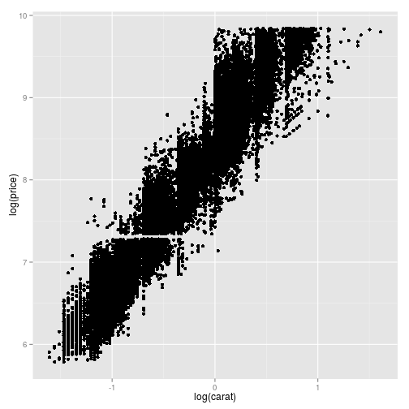 
果不其然，这是一个非常完美的线性关系。不过我们也需要警惕图形的「过分拟合」。这是后话，以后有机会再探讨 

此外，我们可以使用 `color` 参数来控制第三个变量（一般是分类变量）来查看钻石的颜色是否也会影响其价格。具体的命令如下

```r
  qplot(x = carat, y = price, data = df, color = color)
```

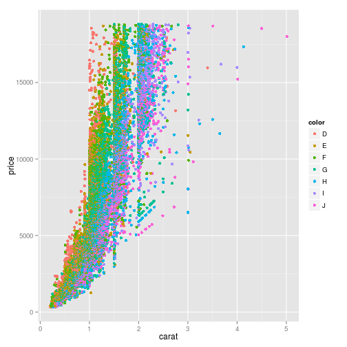 

 
同样的，使用 `shape` 来查看形状效果

```r
  qplot(x = carat, y = price, data = df, shape = cut, color = color)
```

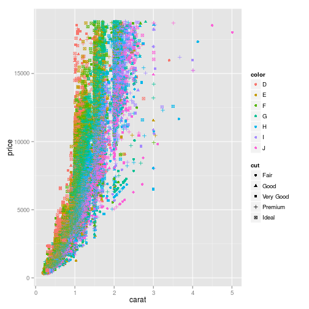 

以上我们介绍了如何控制「修饰」成分命令下面，我们来查看一下如何控制图形输出的「几何」形状。这个主要是通过 `geom` 来实现的。


使用 `smooth` 制作拟合。

```r
qplot(x = carat, y = price, data = df, geom = c("point", "smooth"), color = color)
```

```
## geom_smooth: method="auto" and size of largest group is >=1000, so using gam with formula: y ~ s(x, bs = "cs"). Use 'method = x' to change the smoothing method.
```

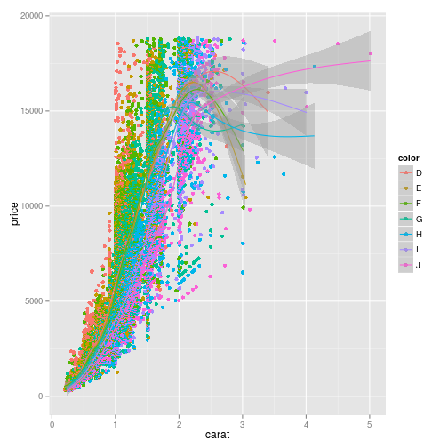 

这个是「箱叶图」

```r
qplot(x = color, y = price, data = df, geom = "boxplot", color = color)
```

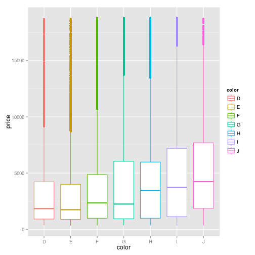 

再来一个`jitter`，同时我们使用参数 `alpha = I()` 来控制渐变的效果。

```r
qplot(x = color, y = price, data = df, geom = "jitter", alpha = I(1/5))
```

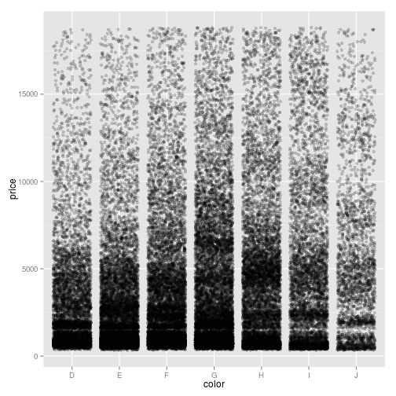 

或者我们想要一个柱状图，则可以使用命令`histogram`， 同时使用参数 `binwidth` 来控制间距，使用 `fill` 来填。

```r
qplot(x = carat, data = df, geom = "histogram", binwidth = .05, fill = color)
```

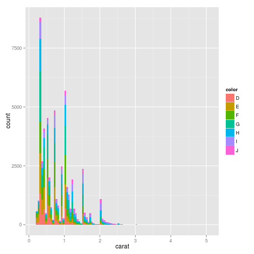 

或者来一个概率分布图，使用 `geom = "density"` 来实现

```r
qplot(x = price, data = df, geom = "density", color = color)
```

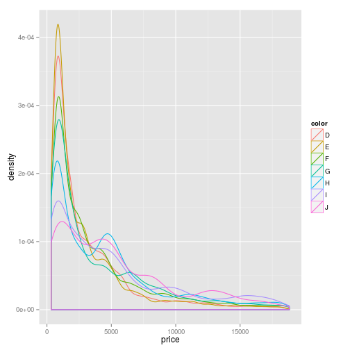 

在实证金融数据分析中，我们经常会遇到形形色色的时间序列数据，对于时间序列数据，我们可以使用 `geom = "line"` 或者 `geom = "path"` 来表明数据随时间变化的特征。

```r
df2 <- data.frame(x = seq(1, 100), y = rnorm(100))
qplot(x, y, data = df2, geom=c("point","line"), col = "red")
```

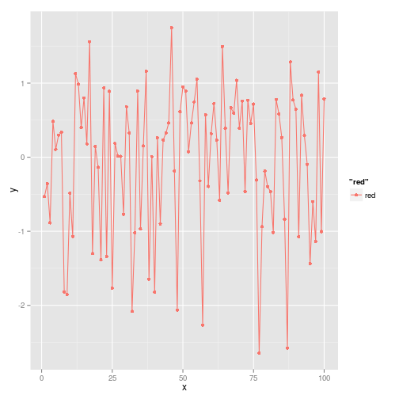 


```r
df3 <- data.frame(x = rnorm(1000), y = rnorm(1000))
qplot(x, y, data = df3, geom=c("point","line"))
```

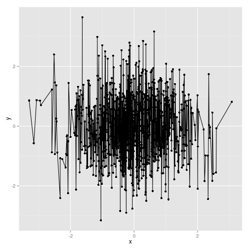 

```r
qplot(x, y, data = df3, geom=c("point","path"))
```

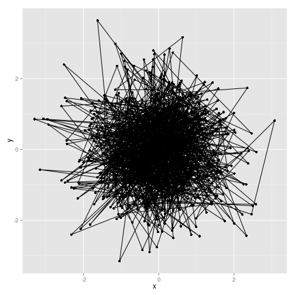 
`geom = "line"` 与 `geom = "path"` 的差别在于前者使用了时间序列数据是按照一定的观测值顺序排列的，而后者则仅仅是按照数据的呈现方式出现。这个需要我们反思在七十年代的时候美国经济学术界内轰轰烈烈的激战是否存在「Philips Curve」，即政府是否存在可以协调经济通胀率与失业率的良方。原先的数据只是按照数据简单的排序，并没有考虑到收集数据内在的时间先后顺序，从而得出通胀率与失业率可替代的结论。而后来这个经过 Friedman 等人的卓越工作，才揭示了原来政府的这套政策是行不通的，原因在于人们是具有理性预期的，如果真的按照政府的经济政策来实施，则会发生「替换性选择」，最终导致政策无效。这个就是典型的使用数据制作「path」图形的案例。}

当然，我么也可以使用 `facets` 来对不同数据子集分别画图，得到不同的图形对比

```r
qplot(x = price, data = df, facets = cut~., geom = "density", color = color)
```

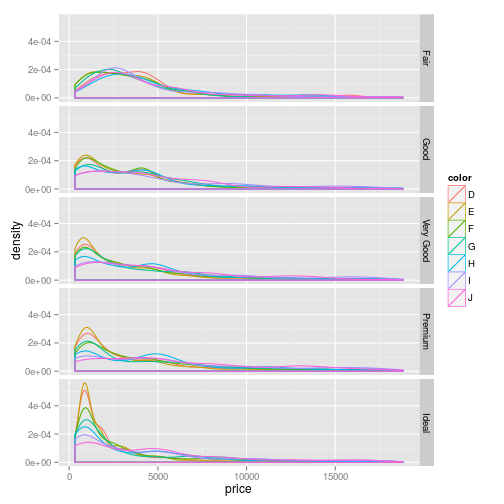 


